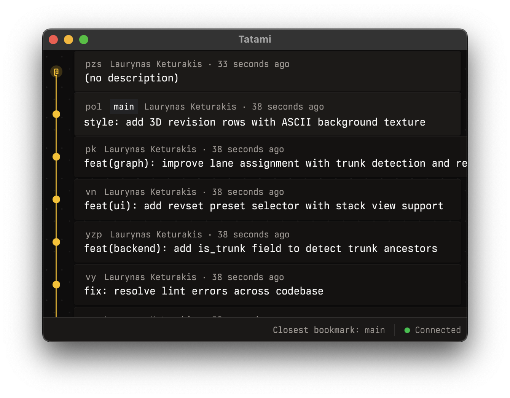

# Tatami

Tatami is a desktop GUI client for [Jujutsu](https://github.com/martinvonz/jj) (`jj`). It’s built with Tauri v2 + React, with a Rust backend that integrates `jj-lib`.



## What it does

- Revset-driven revision graph (lane assignment, trunk detection, related-commit dimming)
- File diff viewer (hunks/lines, syntax highlighting, line numbers)
- Keyboard-first navigation (vim-ish movement + command palette)
- Live updates via filesystem watching
- Persists projects + UI layout state in SQLite (Tauri app data dir)

## Repo layout

- `apps/desktop/` — Tauri + React desktop app
- `apps/desktop/src/` — frontend (TanStack Router/Query/DB, effect-atom, shadcn/ui)
- `apps/desktop/src-tauri/` — Rust backend + Tauri commands
- `assets/` — screenshots and other repo assets

## Quickstart

Prereqs: `bun`, Rust toolchain, Tauri system deps, and `jj`.

```bash
bun install
bun run tauri dev
```

Browser-only UI development is supported via mocks in `apps/desktop/src/mocks/`.

## Contributing

Keep dev commands short and prefer putting release notes in commit bodies.

- Release notes: add a `## RN:` section to commit bodies (optional `RN-ID:` line for stable dedupe)

```bash
# Frontend-only (Vite)
bun run dev

# Frontend checks (from apps/desktop/)
cd apps/desktop
bun run typecheck
bun run lint
bun run format
```

## Publishing

Publishing is automated via GitHub Actions in `.github/workflows/release.yml`.

- Trigger: every push to `main` (plus `workflow_dispatch`)
- Artifacts: macOS-only build for now, published to a GitHub prerelease (`nightly-<run_number>` tags)
- Concurrency: new pushes cancel in-progress builds
- Release notes: collected from commit bodies under a `## RN:` heading; trailers are ignored; use `RN-ID:` for stable dedupe when `jj` history is rewritten

## How it’s wired

- Frontend calls Tauri commands via `apps/desktop/src/tauri-commands.ts`
- Tauri commands live in `apps/desktop/src-tauri/src/lib.rs`
- Backend uses `jj-lib` for repo access and emits repo change events for live refresh

## Issues

This repo uses Fiberplane’s `fp` CLI for local-first issue tracking (configured in `.fp/config.toml`, prefix `TAT`).

```bash
fp issue list
fp tree
fp context TAT-sfsb
```

## More docs

- `CLAUDE.md` — architecture notes + useful dev commands
- `apps/desktop/README.md` — app-specific notes

## License

MIT. See `LICENSE`.
