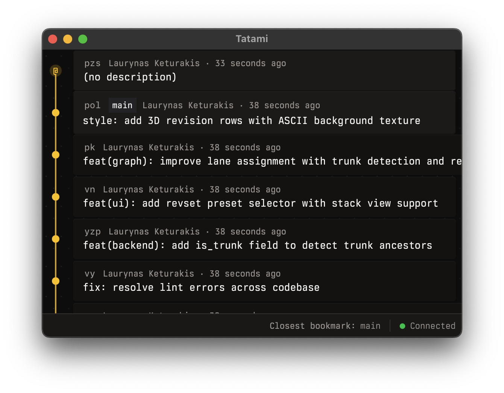

# Tatami

Tatami is a desktop GUI client for [Jujutsu](https://github.com/martinvonz/jj) (`jj`). The active app is built with Electrobun + Svelte 5, with Rust `jj-lib` integration exposed through a Rust Node-API addon.



## What it does

- Revset-driven revision graph (lane assignment, trunk detection, related-commit dimming)
- File diff viewer (hunks/lines, syntax highlighting, line numbers)
- Keyboard-first navigation (vim-ish movement + command palette)
- Live updates via filesystem watching
- Persists projects + UI layout state in the Electrobun app data store

## Repo layout

- `apps/desktop/` — active Electrobun + Svelte desktop app
- `apps/desktop/src/mainview/` — Svelte UI
- `apps/desktop/src-electrobun/` — Bun/Electrobun backend and shared RPC types
- `apps/desktop/native/tatami-jj-native/` — Rust Node-API addon wrapping `jj-lib`
- `assets/` — screenshots and other repo assets

## Quickstart

Prereqs: `bun`, Rust toolchain, and `jj`.

```bash
bun install
bun run dev
```

## Contributing

Keep dev commands short and prefer putting release notes in commit bodies.

- Release notes: add a `## RN:` section to commit bodies (optional `RN-ID:` line for stable dedupe)

```bash
# App checks (from apps/desktop/)
cd apps/desktop
bun run typecheck
bun run lint
bun run format

# Package the desktop app
bun run build
```

## Publishing

Release automation is being updated for the Electrobun app. Existing Tauri-era CI is not authoritative for the new app.

## How it’s wired

- Svelte components call typed Electrobun RPC helpers in `apps/desktop/src/mainview/rpc.ts`
- The Bun backend handles RPC in `apps/desktop/src-electrobun/bun/index.ts`
- Native jj operations are loaded from `apps/desktop/native/tatami-jj-native`
- Backend services use `jj-lib` for repo access and watchers for live refresh

## Issues

This repo uses Fiberplane’s `fp` CLI for local-first issue tracking (configured in `.fp/config.toml`, prefix `TAT`).

```bash
fp issue list
fp tree
fp context TAT-sfsb
```

## More docs

- `CLAUDE.md` — architecture notes + useful dev commands
- `apps/desktop/README.md` — app-specific notes

## License

MIT. See `LICENSE`.
